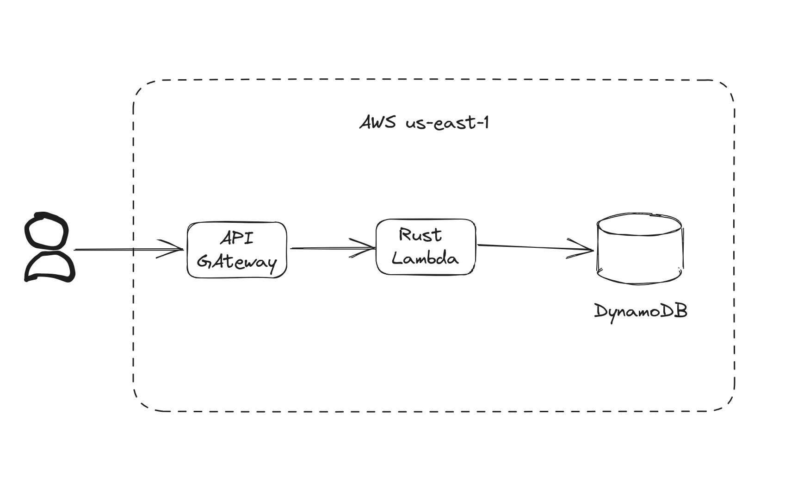
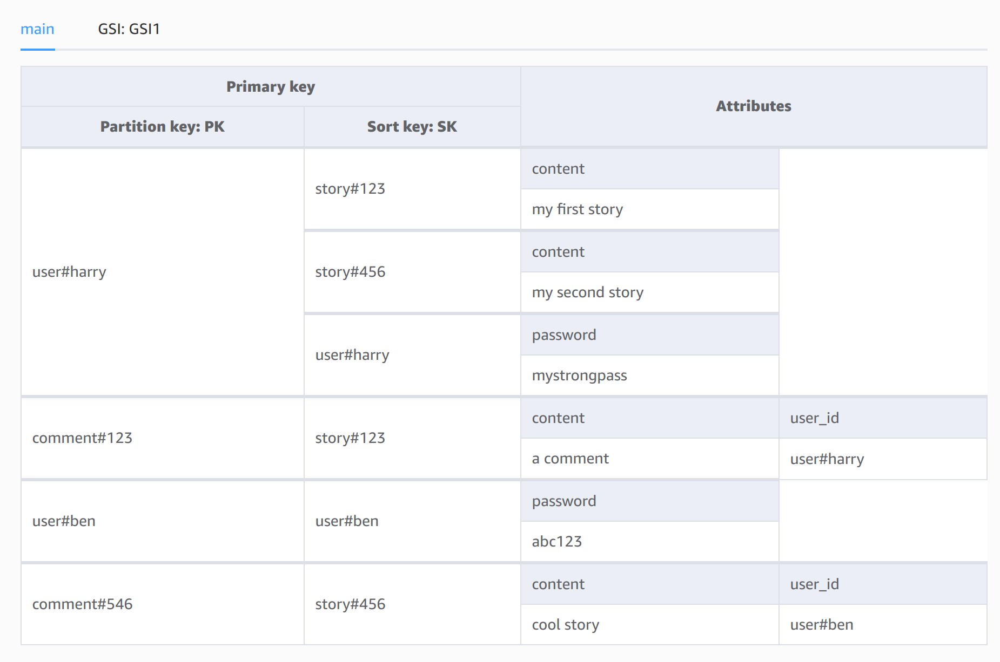
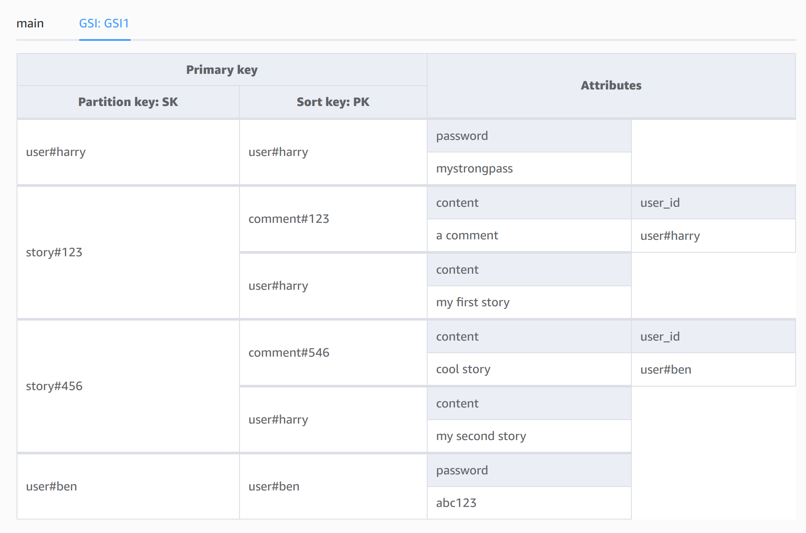

# Simple social network

A simple social network backend rest api with persistent data;

## Overview

I'm using AWS serverless application model and 1 rust lambda function to implement the API.



## Data model

I'm using dynamodb as a database and single table design to store and retrieve relation data.

DynamoDB main table - indexed by user_id



DynamoDB global secondary index - indexed by post_id




## API

### Live endpoint
You can use this deployed endpoint to test the API via curl.

Set `$BASE_URL` environment variable
```bash
export BASE_URL=https://871nsqi1pj.execute-api.us-east-1.amazonaws.com/Prod
```

### Create User
```bash
curl --request POST \
  --url $BASE_URL/user/create \
  --header 'Content-Type: application/json' \
  --data '{ "user_id": "harry", "password": "pass123" }'
```

### Create Story
```bash
curl --request POST \
  --url $BASE_URL/story/create \
  --header 'Content-Type: application/json' \
  --data '{ "user_id": "harry", "content": "first story" }'
```

### Create Comment
```bash
curl --request POST \
  --url $BASE_URL/comment/create \
  --header 'Content-Type: application/json' \
  --data '{ "user_id": "harry", "story_id": "<STORY_ID>", "content":"A comment" }'
```

### List Stories for User
```bash
curl --request GET \
  --url $BASE_URL/stories/harry
```

### List Comments for Story
```bash
curl --request GET \
  --url $BASE_URL/comments/<STORY_ID>
```

### Delete Comment
```bash
curl --request POST \
  --url $BASE_URL/comment/delete \
  --header 'Content-Type: application/json' \
  --data '{ "comment_id": "<COMMENT_ID>", "story_id": "<STORY_ID>" }'
```

### Delete Story
```bash
curl --request POST \
  --url $BASE_URL/story/delete \
  --header 'Content-Type: application/json' \
  --data '{ "user_id": "harry", "story_id": "<STORY_ID>" }'
```

### Delete User
```bash
curl --request POST \
  --url $BASE_URL/user/delete \
  --header 'Content-Type: application/json' \
  --data '{ "user_id": "harry" }'
```

### Development
```bash
# build and deploy
sam build
sam deploy

#logs
sam logs --stack-name <stackname> --name <FnName>
```
